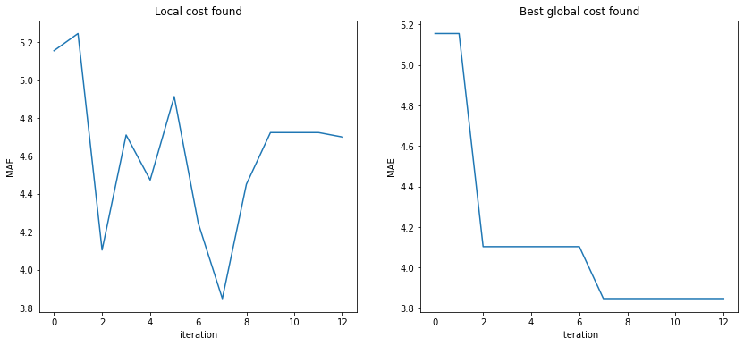

# Time series transformation selection with Estimation of Distribution Algorithms


When working with large datasets in time series Machine Learning projects, it is common to use different time series transformations in order to improve the forecasting model. In this approach an EDA is used to find the optimum transformations of the time series.

This approach is implemented and is part of EDAspy package.

## Example of usage


```python
# loading essential libraries first
import pandas as pd
import statsmodels.api as sm
from statsmodels.tsa.api import VAR
import matplotlib.pyplot as plt
from sklearn.metrics import mean_absolute_error

# EDAspy libraries
from EDAspy.timeseries import EDA_ts_fts as EDA
from EDAspy.timeseries import TS_transformations

```


```python
# import some data
mdata = sm.datasets.macrodata.load_pandas().data
df = mdata.iloc[:, 2:12]
df.head()
```


<div>
<style scoped>
    .dataframe tbody tr th:only-of-type {
        vertical-align: middle;
    }

    .dataframe tbody tr th {
        vertical-align: top;
    }

    .dataframe thead th {
        text-align: right;
    }
</style>
<table border="1" class="dataframe">
  <thead>
    <tr style="text-align: right;">
      <th></th>
      <th>realgdp</th>
      <th>realcons</th>
      <th>realinv</th>
      <th>realgovt</th>
      <th>realdpi</th>
      <th>cpi</th>
      <th>m1</th>
      <th>tbilrate</th>
      <th>unemp</th>
      <th>pop</th>
    </tr>
  </thead>
  <tbody>
    <tr>
      <th>0</th>
      <td>2710.349</td>
      <td>1707.4</td>
      <td>286.898</td>
      <td>470.045</td>
      <td>1886.9</td>
      <td>28.98</td>
      <td>139.7</td>
      <td>2.82</td>
      <td>5.8</td>
      <td>177.146</td>
    </tr>
    <tr>
      <th>1</th>
      <td>2778.801</td>
      <td>1733.7</td>
      <td>310.859</td>
      <td>481.301</td>
      <td>1919.7</td>
      <td>29.15</td>
      <td>141.7</td>
      <td>3.08</td>
      <td>5.1</td>
      <td>177.830</td>
    </tr>
    <tr>
      <th>2</th>
      <td>2775.488</td>
      <td>1751.8</td>
      <td>289.226</td>
      <td>491.260</td>
      <td>1916.4</td>
      <td>29.35</td>
      <td>140.5</td>
      <td>3.82</td>
      <td>5.3</td>
      <td>178.657</td>
    </tr>
    <tr>
      <th>3</th>
      <td>2785.204</td>
      <td>1753.7</td>
      <td>299.356</td>
      <td>484.052</td>
      <td>1931.3</td>
      <td>29.37</td>
      <td>140.0</td>
      <td>4.33</td>
      <td>5.6</td>
      <td>179.386</td>
    </tr>
    <tr>
      <th>4</th>
      <td>2847.699</td>
      <td>1770.5</td>
      <td>331.722</td>
      <td>462.199</td>
      <td>1955.5</td>
      <td>29.54</td>
      <td>139.6</td>
      <td>3.50</td>
      <td>5.2</td>
      <td>180.007</td>
    </tr>
  </tbody>
</table>
</div>


```python
variables = list(df.columns)
variable_y = 'pop'  # pop is the variable we want to forecast
variables = list(set(variables) - {variable_y})  # array of variables to select among transformations
variables
```


    ['realinv',
     'tbilrate',
     'realgdp',
     'unemp',
     'm1',
     'cpi',
     'realdpi',
     'realcons',
     'realgovt']


Build the dataset with all the transformations desired. If some more transformations are desired, then it must be added to the dataset following the next steps:
 1. Add the transformation postfix
 2. Add to the dataset the respective variable with name (name + postfix)


```python
TSTransf = TSTransformations(df)
transformations = ['detrend', 'smooth', 'log']  # postfix to variables, to denote the transformation

# build the transformations
for var in variables:
    transformation = TSTransf.de_trending(var)
    df[var + 'detrend'] = transformation

for var in variables:
    transformation = TSTransf.smoothing(var, window=10)
    df[var + 'smooth'] = transformation

for var in variables:
    transformation = TSTransf.log(var)
    df[var + 'log'] = transformation
```

Define the cost function to calculate the Mean Absolute Error


```python
def cost_function(variables_list, nobs=20, maxlags=15, forecastings=10):
    """
    variables_list: list of variables without the variable_y
    nobs: how many observations for validation
    maxlags: previous lags used to predict
    forecasting: number of observations to predict
    
    return: MAE of the prediction with the real validation data
    """
    
    data = df[variables_list + [variable_y]]

    df_train, df_test = data[0:-nobs], data[-nobs:]

    model = VAR(df_train)
    results = model.fit(maxlags=maxlags, ic='aic')

    lag_order = results.k_ar
    array = results.forecast(df_train.values[-lag_order:], forecastings)

    variables_ = list(data.columns)
    position = variables_.index(variable_y)

    validation = [array[i][position] for i in range(len(array))]
    mae = mean_absolute_error(validation, df_test['pop'][-forecastings:])
    
    return mae
```

We take the normal variables without any time series transformation and try to forecast the y variable using the same cost function defined. 
This value is stored to be compared with the optimum solution found


```python
mae_pre_eda = cost_function(variables)
print('MAE without using EDA:', mae_pre_eda)
```

    MAE without using EDA: 5.091478009948458
    

Initialization of the initial vector of statitstics. Each variable has a 50% probability to be or not chosen


```python
vector = pd.DataFrame(columns=list(variables))
vector.loc[0] = 0.5
```

Run the algorithm. The code will print some further information during execution


```python
eda = EDA(max_it=50, dead_it=5, size_gen=15, alpha=0.7, vector=vector,
          array_transformations=transformations, cost_function=cost_function)
best_ind, best_MAE = eda.run(output=True)
```

    [iteration: 0 ] 5.155357972950526
    [iteration: 1 ] 5.246309408804405
    [iteration: 2 ] 4.103723942647372
    [iteration: 3 ] 4.710694858969362
    [iteration: 4 ] 4.473166010597248
    [iteration: 5 ] 4.913511145463962
    [iteration: 6 ] 4.244706428986632
    [iteration: 7 ] 3.847353187863837
    [iteration: 8 ] 4.450659158760351
    [iteration: 9 ] 4.723562306804138
    [iteration: 10 ] 4.723562306804138
    [iteration: 11 ] 4.723562306804138
    

# Some plots


```python
# some plots
hist = eda.historic_best

relative_plot = []
mx = 999999999
for i in range(len(hist)):
    if hist[i] < mx:
        mx = hist[i]
        relative_plot.append(mx)
    else:
        relative_plot.append(mx)

print('Solution:', best_ind, '\nMAE post EDA: %.2f' % best_MAE, '\nMAE pre EDA: %.2f' % mae_pre_eda)

plt.figure(figsize = (14,6))

ax = plt.subplot(121)
ax.plot(list(range(len(hist))), hist)
ax.title.set_text('Local cost found')
ax.set_xlabel('iteration')
ax.set_ylabel('MAE')

ax = plt.subplot(122)
ax.plot(list(range(len(relative_plot))), relative_plot)
ax.title.set_text('Best global cost found')
ax.set_xlabel('iteration')
ax.set_ylabel('MAE')

plt.show()
```

    Solution: ['realinvsmooth', 'tbilratelog', 'realgdpdetrend', 'm1detrend', 'cpibasic', 'realconssmooth', 'realgovtbasic'] 
    MAE post EDA: 3.85 
    MAE pre EDA: 5.09
    


    

    

